# Экзамен ASP.NET Core — П-318. Теория по темам

Это шпаргалка для подготовки к экзамену. Мы не будем заучивать определения наизусть —
гораздо важнее понимать, **как оно работает** и **зачем мы так делали**. Поэтому по каждой
теме я сначала на словах объясняю идею, потом показываю, как это выглядело в наших проектах
(**Notes**, **PersonalAccount**, **Marketplace**), и где обычно спотыкаются.

Экзамен проходит в формате разговора. Я задам тему, вы расскажете своими словами, я задам
пару уточняющих вопросов — и пойдём дальше. Если что-то подзабыли — ничего страшного,
подскажу. Список тем — в [Exam-Topics.md](Exam-Topics.md).

---

## 1. Как устроено веб-приложение. Razor Pages, MVC и Web API

Начнём с самого начала. Когда вы открываете сайт, браузер (это **клиент**) отправляет на
**сервер** запрос: «дай мне такую-то страницу» или «прими вот эти данные». Сервер этот запрос
обрабатывает и присылает обратно **ответ**. Вот и весь веб в одном предложении: запрос →
обработка → ответ.

Общаются они по протоколу **HTTP**. Можно представить так: клиент кидает на сервер записку
(запрос), сервер читает её, что-то делает и кидает записку обратно (ответ). В ответе может
лежать готовая HTML-страница, а может — просто данные.

Так вот, ASP.NET Core даёт три способа написать ту часть, которая обрабатывает запрос на
сервере. Мы за курс потрогали все три, и важно понимать не столько их устройство, сколько
**в чём разница**.

**Razor Pages** (проект Notes). Здесь страница и её логика лежат рядышком. Браузер просит
страницу — срабатывает обработчик `OnGet` или `OnPost` внутри `PageModel`, формируется HTML
и уходит обратно. Поток такой:
```
Клиент → Сервер → Page → PageModel → On[GET/POST] → HTML → Клиент
```

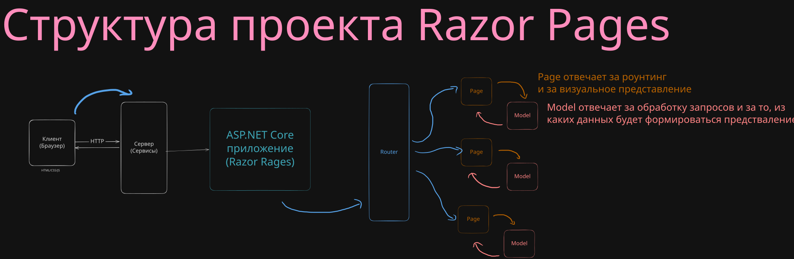

*Razor Pages: Router → Page (+ Model). Page отвечает и за маршрут, и за представление.*

**MVC** (проект PersonalAccount). Тут запрос сначала попадает в **контроллер**. Он решает,
что делать, готовит **модель** (данные) и отдаёт их во **View**, а View уже рисует HTML.
Удобно, когда экранов много: один `CabinetController` обслуживает и `Index`, и `Student`, и
`Admin`, и `Edit`.
```
Клиент → Сервер → Controller → Model → View → HTML → Клиент
```

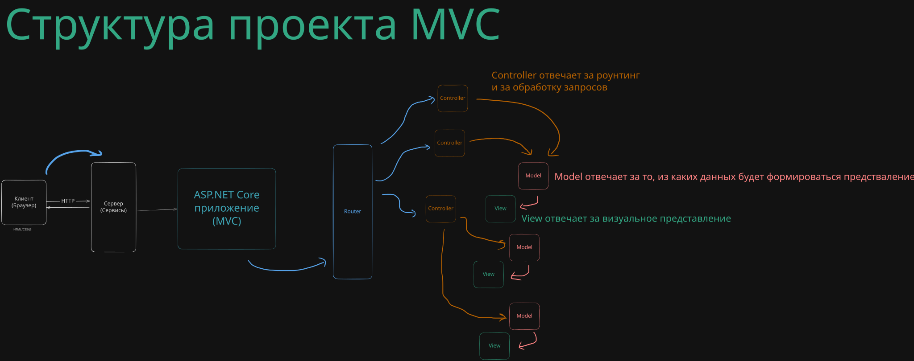

*MVC: Router → Controller, который готовит Model и выбирает View.*

**Web API** (проект Marketplace). А вот здесь контроллер не рисует страницу вообще — он
возвращает **данные в формате JSON**. HTML рисует уже отдельный фронтенд (у нас Next.js).
```
Клиент → Backend → Controller → Service → Repository
Controller → [JSON] → Клиент
Клиент → Frontend (Next.js) → рисует HTML/CSS/JS
```

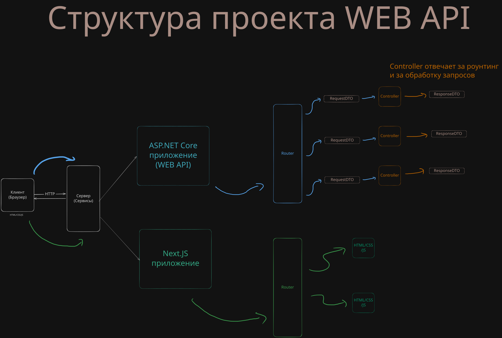

*Web API: Router → Controller, наружу — Request/Response DTO; ответ в JSON.*

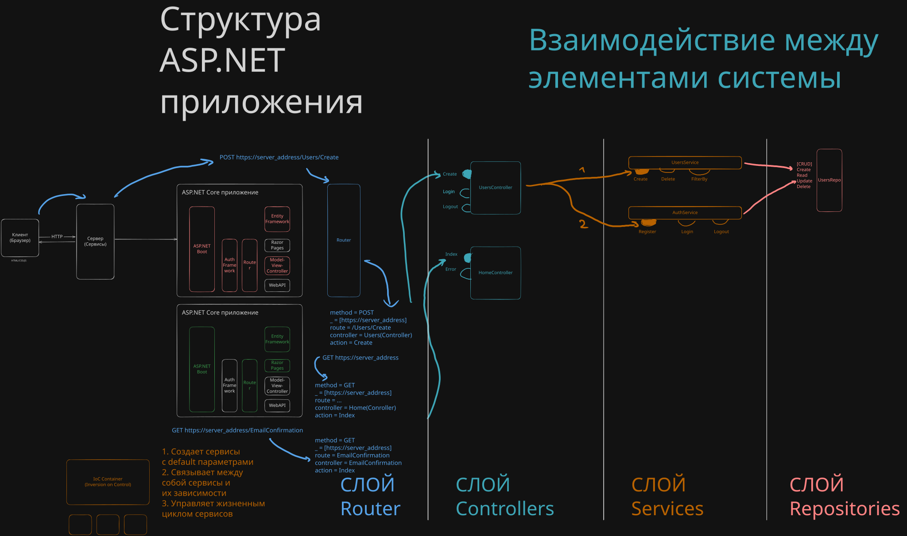

*Общий поток: на входе Router и Auth, затем один из подходов (Razor Pages / MVC / Web API) и EF Core к базе. Справа — как Router разбирает `POST /Users/Create` на controller и action.*

### Что происходит с запросом по дороге — разбираем по шагам
Выше я сказал «сервер обрабатывает запрос» — и это звучит так, будто там одно действие. На
самом деле запрос проходит небольшой путь внутри приложения, прежде чем доберётся до вашего
кода. Давайте пройдём этот путь целиком, потому что именно про него я люблю спросить.

**Шаг 1. Запрос приходит как текст, и его надо разобрать.** По сети к нам прилетает не готовый
объект, а просто набор байтов — текст по правилам HTTP. Выглядит он примерно так:
```
POST /Users/Create HTTP/1.1
Host: localhost:5001
Content-Type: application/x-www-form-urlencoded
Cookie: .AspNetCore.Cookies=CfDJ8N...

Name=Анна&Email=anna@mail.ru
```
Первая строка — самое важное: **метод** (`POST`) и **путь** (`/Users/Create`). Дальше идут
**заголовки** (кто хост, какой формат тела, какие куки), пустая строка, и после неё — **тело**
запроса (данные формы). Веб-сервер (в ASP.NET Core это **Kestrel**) принимает эти байты и
**парсит** их: раскладывает в удобный объект `HttpRequest`, где уже по отдельности лежат
`Method`, `Path`, `Headers`, `Cookies`, `Body`. С этого момента мы работаем не с текстом, а с
нормальным объектом.

**Шаг 2. Запрос идёт по конвейеру (middleware).** Дальше он проходит через цепочку обработчиков
— её мы собирали в `Program.cs`. Каждый кусок что-то делает с запросом и передаёт дальше:
```csharp
app.UseRouting();          // понять, какому маршруту соответствует запрос
app.UseAuthentication();   // разобраться, КТО это (прочитать cookie)
app.UseAuthorization();    // решить, МОЖНО ли ему сюда
app.MapControllers();      // отдать запрос нужному контроллеру
```
Представьте конвейер на заводе: деталь едет по ленте, и на каждой станции с ней что-то делают.
Порядок тут — не формальность, а смысл: нельзя проверить права (`UseAuthorization`) раньше,
чем мы выяснили, кто пользователь (`UseAuthentication`). Поэтому строки именно в таком порядке.

**Шаг 3. Роутинг сопоставляет путь с вашим кодом.** Вот тут и работает **роутер**. Его задача —
по строке `/Users/Create` понять, **какой метод какого класса** надо вызвать. Делает он это по
шаблону маршрута. Для MVC шаблон обычно такой:
```
{controller}/{action}/{id?}
```
Роутер прикладывает путь к шаблону и разбирает его на части:
- `Users` → это **controller**, значит ищем класс `UsersController`;
- `Create` → это **action**, значит ищем метод `Create` внутри него;
- `id` в конце нет — он помечен `?`, то есть необязательный, и это нормально.

А ещё учитывается **метод** запроса. Запрос пришёл `POST`, значит из двух методов `Create`
(один помечен `[HttpGet]`, другой `[HttpPost]`) роутер выберет именно `POST`-овый. Так одна и
та же ссылка `/Users/Create` спокойно работает и на показ формы (GET), и на её приём (POST) —
это мы постоянно использовали в формах.

> [ВАЖНО] Роутер не «выполняет» ваш код — он только **находит**, что нужно выполнить:
> контроллер + action. Если совпадения нет (например, `/Users/Delet` с опечаткой) — никакой
> метод не вызывается, и пользователь получает **404**. 404 — это в большинстве случаев «роутер
> не нашёл подходящий маршрут», а вовсе не «ошибка в коде».

**Шаг 4. Model binding — данные из запроса раскладываются по параметрам.** Роутер нашёл метод
`Create(UserViewModel model)`. Но откуда возьмётся сам `model`? Его собирает **model binding**:
берёт данные из запроса и заполняет ими параметры метода. Причём смотрит сразу в несколько мест
— в путь, в query-строку (`?page=2`), в тело формы. В нашем примере из тела
`Name=Анна&Email=anna@mail.ru` он создаст объект и проставит `model.Name = "Анна"`,
`model.Email = "anna@mail.ru"`. Вам в методе уже прилетает готовый объект — руками ничего из
запроса доставать не нужно.

**Шаг 5. Выполняется ваш код и формируется ответ.** Только теперь вызывается тело вашего
action’а. Он что-то делает (обычно зовёт сервис, тот — репозиторий, тот — базу) и возвращает
**результат**: `View(model)`, `RedirectToAction(...)`, `Ok(data)` или `NotFound()`. Этот
результат ASP.NET Core превращает обратно в HTTP-ответ — текст со **статус-кодом** (200, 302,
404…), заголовками и телом — и отправляет браузеру. Круг замкнулся: запрос → разбор → роутинг →
binding → ваш код → ответ.

Если уложить всё в одну строчку, поток такой:
```
Kestrel (парсит байты) → middleware → Routing (находит controller+action)
→ Model binding (собирает параметры) → ваш Action → Result → HTTP-ответ
```

### А в чём, собственно, разница?
Если выкинуть все детали и оставить главное — разница в том, **кто рисует то, что увидит
пользователь**:

- Razor Pages и MVC рисуют **готовый HTML прямо на сервере**. Браузер получает уже
  нарисованную страницу.
- Web API отдаёт **только данные**, а рисованием занимается отдельный фронтенд на стороне
  клиента.

Отсюда и выбор под задачу. Простой страничный сайт — берём Razor Pages, чтобы не разводить
лишнюю структуру. Логики побольше, экранов много — MVC. А если бэкенд должен кормить данными
сразу несколько клиентов (сайт, мобильное приложение) — делаем Web API и отдельный фронт,
чтобы они развивались независимо друг от друга. Marketplace мы специально собрали по третьей
схеме именно поэтому.

### Где спотыкаются
- «MVC всегда отдаёт HTML, а API — JSON» — да, по сути в этом и разница. Технически и там, и
  там контроллеры, но базовый класс и назначение разные: `Controller` умеет возвращать View,
  `ControllerBase` — только данные.
- MVVM, который мы упоминали, — это вообще про фронтенд, не путайте его с серверными MVC и
  Razor Pages.

### Вопросы для самопроверки
1. Над какими проектами мы работали и какой по какой схеме сделан?
2. Чем ответ Web API отличается от ответа MVC?
3. Почему для Marketplace мы выбрали API + отдельный фронт, а не один большой сайт?
4. Что делает роутер, когда приходит `POST /Users/Create`? На какие части он разбирает путь?
5. Почему `UseAuthentication` стоит в конвейере раньше `UseAuthorization`?
6. Откуда в методе `Create(UserViewModel model)` берётся заполненный `model`?

---

## 2. Dependency Injection и принципы проектирования

Представьте, что классу `IndexModel` нужен сервис заметок. Самый прямолинейный путь — взять и
создать его прямо внутри: `var service = new InMemoryNoteService();`. Работать будет. Но тут
есть проблема: `IndexModel` теперь намертво привязан к конкретному классу. Захотели завтра
переключиться с памяти на базу данных — лезьте и правьте сам `IndexModel`.

**Dependency Injection (внедрение зависимостей)** разворачивает эту картинку. Класс не создаёт
свои зависимости сам, а **получает их готовыми снаружи** — обычно через конструктор. Кто и
что подставит, решает специальный механизм — **IoC-контейнер**, встроенный в ASP.NET Core.
Мы прописывали зависимости в `Program.cs`:
```csharp
builder.Services.AddScoped<INoteService, SqliteNoteService>();
builder.Services.AddDbContext<AppDbContext>(o => o.UseSqlite(connectionString));
```
А `IndexModel` просто говорит «мне нужен `INoteService`» — и контейнер сам его приносит.

### Почему это вообще важно
На занятии мы затрагивали принцип **инверсии зависимостей** (это буква **D** в `SOLID`). Если
вкратце — то взаимодействие между классами должно идти через интерфейс, и этот интерфейс
принадлежит не тому, кто его реализует, а тому, кто им пользуется.

На нашем примере: какой будет интерфейс `INoteService`, определяет **не** `InMemoryNoteService`,
а `IndexModel`, который этим сервисом пользуется. Метод `Delete` появился в интерфейсе не
потому, что список умеет удалять, а потому что у `IndexModel` возникла потребность удалить
заметку. Зависимость как бы «перевёрнута».

Практическая выгода — **можно подменить реализацию, не трогая того, кто ей пользуется**. В
Notes мы переключались между двумя реализациями `INoteService` буквально одной строкой:
```csharp
// builder.Services.AddSingleton<INoteService, InMemoryNoteService>();
builder.Services.AddScoped<INoteService, SqliteNoteService>();
```
И `IndexModel` при этом не менялся вообще.

### Жизненные циклы — Singleton, Scoped, Transient
Когда мы регистрируем сервис, мы заодно говорим контейнеру, **как долго он должен жить**:

- **Singleton** — один экземпляр на всё приложение. `InMemoryNoteService` был синглтоном, и
  это принципиально: он же хранит список заметок прямо внутри себя. Пересоздавался бы — и
  данные терялись бы при каждом запросе.
- **Scoped** — один экземпляр на один HTTP-запрос. `SqliteNoteService` сделали scoped, потому
  что он завязан на `DbContext`, а `DbContext` тоже scoped (живёт в рамках одного запроса).
- **Transient** — новый экземпляр каждый раз, когда его просят.

[ВАЖНО] Нельзя засунуть scoped-сервис внутрь singleton. Singleton переживёт запрос и
«утащит за собой» уже мёртвый scoped-объект (например, закрытый `DbContext`). Поэтому в-memory
сервис у нас singleton, sqlite — scoped, и это не случайность.

### Где спотыкаются
- Добавили новый сервис, но забыли `AddScoped` в `Program.cs` — и на запросе ловите
  `Unable to resolve service for type '...'`. В домашках я не зря напоминал: «не забываем
  добавить зависимости в `Program.cs`».
- Перепутали lifetime: in-memory сделали scoped — данные «не сохраняются»; sqlite сделали
  singleton — проект не собирается из-за захваченного `DbContext`.

### Вопросы для самопроверки
1. Что такое Dependency Injection своими словами и зачем он нужен?
2. Почему `IndexModel` работает с `INoteService`, а не с конкретным классом?
3. Почему in-memory-сервис был Singleton, а sqlite — Scoped?

---

## 3. Слои приложения и модели данных

Когда проект маленький, заманчиво писать всё в одном месте: контроллер сам лезет в базу, сам
крутит логику, сам собирает данные для страницы. Поначалу быстро, а потом такой контроллер
превращается в кашу, в которой невозможно разобраться.

Поэтому код мы раскладываем по **слоям**, у каждого своя зона ответственности. В Marketplace
это видно лучше всего:
```
Controller → Service → Repository → DbContext / БД
```
- **Контроллер** — тонкий: принял запрос, позвал сервис, вернул ответ.
- **Сервис** — бизнес-логика (например, вся логика покупки в `PurchaseService`).
- **Репозиторий** — доступ к данным, запросы в базу.

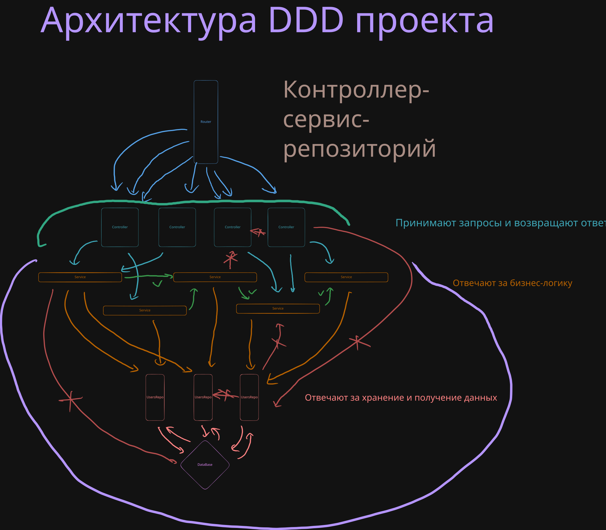

*Контроллер принимает запрос, сервис отвечает за бизнес-логику, репозиторий — за хранение и получение данных, дальше база.*

Параллельно с этим одни и те же данные у нас описываются **разными классами**, и это часто
вызывает вопрос «зачем так много?». Смотрите:
- **Entity** (`ProductEntity`) — как строка лежит в базе.
- **Model** (`ProductModel`) — доменная модель внутри кода.
- **DTO** — то, что мы отдаём или принимаем наружу. В API это **Request/Response**
  (`CreateProductRequest`, `GetProductPreviewResponse`), в MVC — **ViewModel**
  (`StudentEditViewModel`).

Перекладывает данные между этими формами **маппер**:
```csharp
public override ProductModel MapToModel(ProductEntity entity) =>
    base.MapToModel(entity) with
    {
        Name = entity.Name,
        Price = entity.Price,
        // ...
    };
```

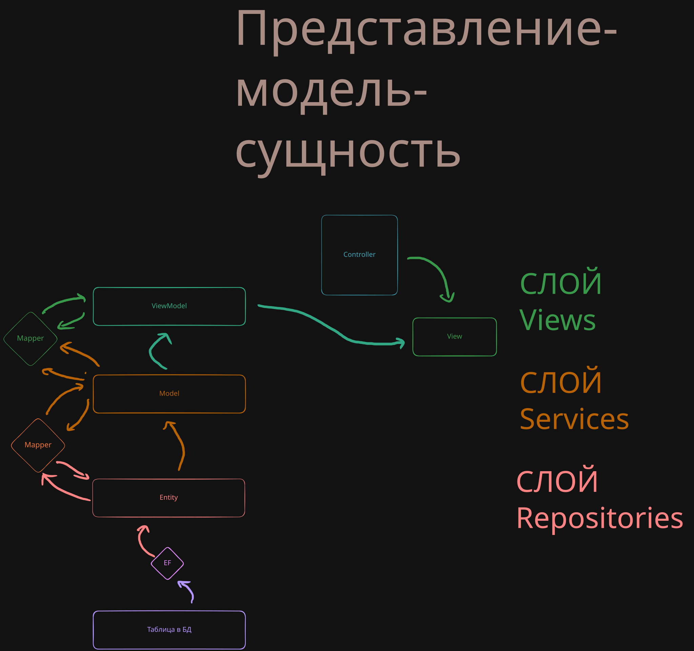

*Одни и те же данные на каждом слое: таблица → Entity → Model → ViewModel → View, между слоями — мапперы.*

### Почему не один класс на всё
Дело в том, что формат хранения в базе, внутренняя логика приложения и то, что видит клиент, —
это **три разные вещи, которые меняются независимо**. Поменяли структуру таблицы — трогаете
Entity, а контракт API при этом не ломается. Плюс безопасность: наружу отдаём только то, что
нужно. В ДЗ №4 поле `Email` мы специально сделали нередактируемым, а `StudentEditViewModel`
содержит только `FullName`, `GroupName` и `PhotoUrl` — ничего лишнего.

Хороший пример — кабинет администратора из ДЗ №5. Там мы завели отдельный
`AdminCabinetStudentViewModel`, **хотя поля сначала один в один совпадали** с профилем
студента. Зачем? Затем, что это разные модели с разной ответственностью: одна описывает
профиль студента в доменной логике, другая — что нужно показать в админ-панели. Со временем
они разойдутся (админу понадобятся статус почты, дата регистрации и т.д.), и хорошо, что мы
их сразу разделили.

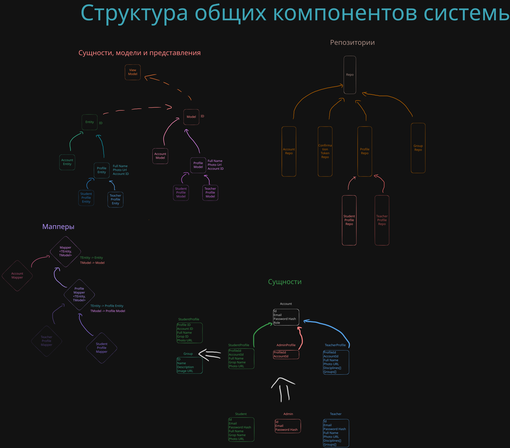

*Сущности домена: Account (Id, Email, PasswordHash, Role) и профили Student / Teacher / Admin, Group — каждая со своими полями.*

### Где спотыкаются
- Отдавать Entity прямо клиенту — соблазнительно, но так делать не стоит: наружу утекает
  схема базы и лишние поля.
- «Зачем маппер, если можно скопировать поля руками» — можно, но маппер собирает это
  преобразование в одном месте и убирает дублирование.

### Вопросы для самопроверки
1. Опишите путь запроса от контроллера до базы в Marketplace.
2. Зачем нам и Entity, и Model, и ViewModel — почему не один класс?
3. Почему в админ-кабинете завели отдельную ViewModel, хотя поля совпадали?

---

## 4. Базы данных через EF Core

### Сначала — что такое ORM и зачем она вообще нужна
Тут есть одна фундаментальная нестыковка, и пока её не проговоришь, EF Core кажется магией.
Смотрите: у нас в коде данные живут в виде **объектов** — у `User` есть поле `Name`, поле
`Email`, он может ссылаться на другой объект `Group`. А в базе данных всё устроено иначе — там
**таблицы, строки и колонки**, и никаких объектов и ссылок между ними нет, только числа-ключи.
Два разных мира, которые говорят на разных языках.

Раньше (до ORM) этот разрыв сшивали руками. Чтобы достать пользователя, вы писали SQL-строку,
отправляли её в базу, получали назад «сырые» строки таблицы и **вручную** перекладывали каждую
колонку в поле объекта. Выглядело это примерно так:
```csharp
// «по старинке»: SQL руками + ручная сборка объекта
var sql = "SELECT Id, Name, Email FROM Users WHERE Id = @id";
// ... открыть соединение, выполнить, пройтись по reader ...
var user = new User {
    Id    = reader.GetInt32(0),
    Name  = reader.GetString(1),
    Email = reader.GetString(2),
};
```
Скучно, многословно и легко ошибиться: опечатался в названии колонки или перепутал порядок —
узнаешь только в рантайме.

**ORM (Object-Relational Mapping, объектно-реляционное отображение)** — это и есть тот самый
«переводчик» между двумя мирами. Она берёт на себя сшивку: вы работаете с обычными
C#-объектами, а ORM сама генерирует SQL и сама раскладывает результат обратно по объектам.
**EF Core** — это ORM от Microsoft, мы её и использовали. Тот же запрос с ней:
```csharp
// с EF Core: ни строчки SQL
var user = _context.Users.Find(id);
```
Одна строка вместо десятка — и SQL под капотом EF напишет сам.

### Плюсы — почему мы её взяли
- **Пишем на C#, а не на SQL.** Запросы — это обычный LINQ (`Where`, `OrderBy`, `Select`),
  привычный по C#. Не надо держать в голове два языка.
- **Меньше рутины и меньше ошибок.** Не нужно руками перекладывать колонки в поля — этим
  занимается EF. Соответственно и багов из-за ручной сборки нет.
- **Компилятор на нашей стороне.** Опечатку в `n.Titlee` подсветит IDE ещё до запуска. А
  опечатку в SQL-строке `"SELCT ..."` — нет, она вылезет только в рантайме.
- **Схема базы живёт в коде.** Через миграции структуру базы описывает сам код (об этом ниже),
  не надо отдельно вести SQL-скрипты.
- **База легко меняется.** Один и тот же код почти без правок работает и с SQLite, и с
  PostgreSQL — меняется в основном провайдер. Мы этим прямо воспользовались: учебные проекты на
  SQLite, Marketplace на Postgres.

### Минусы — за всё надо платить
Честно проговорим и обратную сторону, иначе картинка неполная:
- **Скрытый SQL.** Вы не видите, какой именно запрос ушёл в базу. Можно случайно написать
  невинный с виду код, который сгенерирует тяжеленный запрос. Классика — **проблема N+1**: в
  цикле дёргаете связанные данные, и вместо одного запроса EF делает их сотню.
- **На сложных запросах ORM пасует.** Хитрую аналитику иногда проще и эффективнее написать
  чистым SQL, чем выкручивать через LINQ.
- **Меньше контроля над производительностью.** За удобство платим тем, что между нами и базой
  есть прослойка, которая иногда генерирует не самый оптимальный SQL.
- **Надо понимать, что под капотом.** Самая частая беда — не понимать, **где** выполняется
  фильтрация (в базе или уже в памяти). Ровно об этом — раздел про `IQueryable` ниже.

> [ВАЖНО] ORM не отменяет знание SQL, а надстраивается над ним. Для 90% обычных запросов EF
> Core удобнее и безопаснее; но понимать, какой SQL он генерирует, всё равно нужно — иначе
> легко словить тормоза на ровном месте.

### Теперь как это устроено в EF Core
- **DbContext** (`AppDbContext`) — это наша точка входа к базе, а **DbSet\<T>** внутри него —
  это таблица.
- **Миграции** держат схему базы в соответствии с кодом. Поменяли модель — создаёте миграцию
  и применяете её:
  ```bash
  dotnet ef migrations add AddRoleSystem
  dotnet ef database update
  ```
- **SaveChanges** — момент, когда изменения реально уходят в базу.

### Запомните: операции откладываются
Это важная штука, на которой многие спотыкаются. Когда вы удаляете заметку (ДЗ №1):
```csharp
var note = _context.Notes.Find(id);   // нашли
_context.Notes.Remove(note);          // пометили на удаление — но пока только в памяти
_context.SaveChanges();               // вот теперь запрос реально ушёл в базу
```
`Find`, `Remove`, `Add` сами по себе ничего в базе не меняют — они лишь копят изменения внутри
контекста. Пока вы не вызвали `SaveChanges`, в базе всё по-старому.

### Фильтруйте запросом, а не в памяти
В ДЗ №2 мы делали фильтр заметок и собирали запрос через `IQueryable`:
```csharp
var query = _context.Notes.AsQueryable();
switch (filter)
{
    case ImportanceFilter.ImportantOnly:    query = query.Where(n => n.IsImportant);  break;
    case ImportanceFilter.NotImportantOnly: query = query.Where(n => !n.IsImportant); break;
    // All — Where не добавляем
}
```
Фокус в том, что `Where` у `IQueryable` **превращается в SQL** и уезжает в базу. Из базы
приходят только нужные строки. А если бы вы написали `_context.Notes.ToList().Where(...)`, то
EF сначала вытащил бы **всю** таблицу в память и только потом фильтровал. На паре заметок
разницы не видно, но на реальных данных это небо и земля.

[ВАЖНО] `List.Where` и `IQueryable.Where` выглядят одинаково, но работают по-разному: первый
фильтрует в памяти, второй уезжает в SQL. Для `InMemoryNoteService` мы об этом не парились —
там и так всё в оперативке.

И ещё пара полезных мелочей. `enum` в EF Core по умолчанию хранится **числом** (`Admin → 0`,
`Student → 1`) — это всплыло в ДЗ №5, когда мы руками добавляли студентов в SQLite через SQL.
А для запросов только на чтение есть `AsNoTracking()` — EF тогда не отслеживает такие объекты,
и это чуть быстрее.

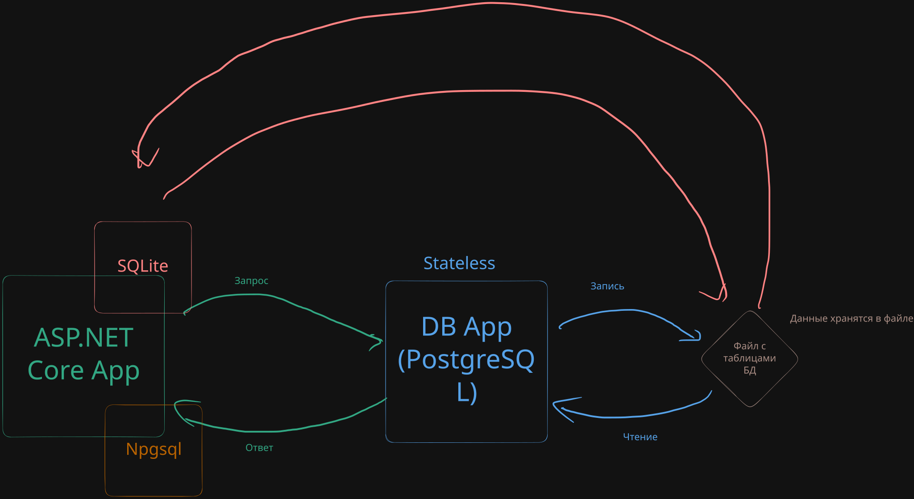

*SQLite — встроенная библиотека: вся база лежит в одном файле. PostgreSQL — отдельный сервер, к нему ходят по сети; приложение при этом stateless.*

### SQLite и PostgreSQL — это две очень разные вещи
Мы поработали с обеими базами, и важно понимать, чем они отличаются по своей природе:

- **SQLite** (Notes, PersonalAccount) — это **не отдельное приложение, а библиотека**, которая
  встраивается прямо в наш процесс. Никакого «сервера базы данных» не запускается. Вся база —
  это **один файл на диске** (`personal_account.db`), а обращается к нему наш код через
  библиотеку. Ставить и поднимать отдельно нечего — поэтому она так удобна для учёбы.
- **PostgreSQL** (Marketplace) — это **отдельное приложение, сервер базы данных**, который
  работает сам по себе (у нас — в своём Docker-контейнере `database`). Приложение
  подключается к нему **по сети**, по адресу и порту (`Host=database;Port=5432;...`). Такой
  сервер обслуживает сразу много клиентов, умеет блокировки и транзакции — поэтому покупки в
  Marketplace мы делали именно на нём.

Главная мысль: **SQLite живёт внутри самого приложения (файл + библиотека), а Postgres — это
отдельный сервер по сети.** При этом код через EF Core почти одинаковый — меняется в основном
строка подключения и провайдер (`UseSqlite` против `UseNpgsql`).

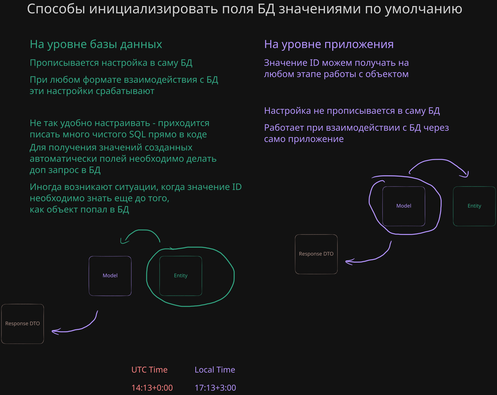

*Значения по умолчанию можно задавать на уровне БД или приложения; иногда ID нужен ещё до записи в базу; время удобнее хранить в UTC.*

### Где спотыкаются
- Забыли `SaveChanges` — «удалил/добавил, а в базе ничего не изменилось». Самая частая ошибка.
- Взяли объект через `AsNoTracking`, поменяли его и ждёте, что `SaveChanges` сохранит — не
  сохранит. No-tracking только для чтения.
- Поменяли модель, а миграцию не создали — код ждёт новую колонку, а её в базе нет.

### Вопросы для самопроверки
1. Что такое ORM и какую проблему она решает? Что было бы, если бы её не было?
2. Назовите по паре плюсов и минусов EF Core.
3. Что делает `SaveChanges` и почему `Add`/`Remove` без него ничего не меняют?
4. Что такое миграция и какими командами мы её делали?
5. Чем SQLite по своей природе отличается от PostgreSQL?

---

## 5. Формы и обработка запросов (GET/POST, model binding, PRG)

Любое изменение данных пользователь делает через форму. И тут первое, что нужно понять, — это
разница между методами запроса. В формах нам в основном хватало двух:

- **GET** — «покажи/дай». Ничего на сервере не меняет.
- **POST** — «измени». Что-то на сервере меняется.

### Методов на самом деле больше
GET и POST — это лишь два самых ходовых. Всего же у HTTP есть целая семья методов, и каждый по
смыслу отвечает за свою операцию CRUD (Create-Read-Update-Delete):

- **GET** — прочитать (Read). Получить данные, ничего не меняя.
- **POST** — создать (Create). Добавить новую запись.
- **PUT / PATCH** — обновить (Update). `PUT` — заменить запись целиком, `PATCH` — поправить
  часть полей.
- **DELETE** — удалить (Delete).

Метод — это не техническая формальность, а **обещание о намерении**: GET обязан быть
безопасным (только читает), а POST/PUT/PATCH/DELETE — меняют данные. Поэтому поисковый робот
спокойно ходит по GET-ссылкам, но никогда не дёргает DELETE.

> [ВАЖНО] HTML-форма по своей природе умеет отправлять **только GET и POST** — третьего ей не
> дано. Поэтому в наших Razor Pages и MVC мы всё изменяющее (создать, удалить, обновить) делали
> через **POST**. А вот полноценные `PUT`, `PATCH`, `DELETE` появляются в **Web API**
> (Marketplace) — там запросы шлёт уже не форма, а фронтенд/Postman, и он эти методы умеет.
> Подробнее про весь набор — в теме 9.

В ДЗ №2 мы делали фильтр заметок через **GET**:
```html
<form method="get">
    <select name="filter" onchange="this.form.submit()"> ... </select>
</form>
```
А удаление заметки в ДЗ №1 — через **POST**, потому что удаление меняет данные:
```html
<form method="post" asp-page-handler="Delete">
    <input type="hidden" name="id" value="@Model.Id"/>
    <button type="submit">Удалить</button>
</form>
```

[ВАЖНО] Фильтрация именно через `GET`, а не `POST`. Выбор фильтра не меняет данные на сервере,
а только меняет, как мы их показываем. Плюс приятный бонус: фильтр попадает в URL, и такую
страницу можно обновить или переслать другу.

### Как данные формы попадают в код
Это называется **model binding**. Атрибут `name` у поля связывается с параметром обработчика
по имени. В удалении скрытое поле `name="id"` передаёт id нужной заметки в:
```csharp
public IActionResult OnPostDelete(int id, ImportanceFilter filter) { ... }
```

### Паттерн PRG (Post-Redirect-Get)
После POST мы не возвращаем HTML напрямую, а делаем перенаправление:
```csharp
_notes.Delete(id);
return RedirectToPage(new { filter });   // браузер заново запросит страницу через GET
```
Зачем? А вот попробуйте удалить заметку, а потом нажать F5. Если бы мы вернули страницу прямо
в ответ на POST, браузер переспросил бы «отправить форму ещё раз?» и удалил бы ещё одну
заметку. После `RedirectToPage` обновление страницы — это уже обычный безобидный GET.

Заодно через перенаправление мы **сохраняем фильтр**: прокидываем его во все обработчики и в
`RedirectToPage`. Иначе после любого действия пользователя выкинет обратно в режим «Все».

### Где спотыкаются
- Меняют данные через GET (например, удаление по ссылке `/delete?id=5`). Так нельзя: браузер
  или поисковый робот может «нажать» такую ссылку случайно. Изменение — только POST.
- В форме `name="noteId"`, а в обработчике параметр `int id` — имена не совпали, и придёт `0`.
- Забыли прокинуть `filter` в `RedirectToPage` — фильтр сбрасывается после каждого действия.

### Вопросы для самопроверки
1. Почему фильтр мы сделали через GET, а удаление через POST?
2. Какие ещё есть HTTP-методы кроме GET и POST и за какие операции CRUD они отвечают?
3. Почему в Razor Pages/MVC всё изменяющее шло через POST, а PUT/DELETE появились только в API?
4. Зачем после POST делать Redirect, а не возвращать страницу сразу?
5. Как id заметки попадает в обработчик `OnPostDelete`?

---

## 6. Валидация данных

Пользователь может прислать что угодно. Поэтому всё, что приходит с формы, нужно проверять.
Правила мы вешали прямо на **ViewModel** атрибутами, а в контроллере смотрели `ModelState`.

В ДЗ №4 форма редактирования профиля:
```csharp
public class StudentEditViewModel
{
    [Required(ErrorMessage = "Укажите имя")]
    public string FullName { get; set; } = string.Empty;
    [Required(ErrorMessage = "Укажите группу")]
    public string GroupName { get; set; } = string.Empty;
    public string? PhotoUrl { get; set; }   // необязательное
}
```
```csharp
[HttpPost]
[ValidateAntiForgeryToken]
public async Task<IActionResult> Edit(StudentEditViewModel model)
{
    if (!ModelState.IsValid) return View(model);   // невалидное не пропускаем, показываем ошибки
    // ... обновляем данные
    return RedirectToAction("Index");
}
```

### Клиенту доверять нельзя
Это главная мысль всей темы. Проверки в браузере (на JS) — это удобство для пользователя,
чтобы он сразу видел ошибку. Но их **легко обойти**: можно отправить запрос мимо формы, через
Postman или curl. Поэтому серверная проверка обязательна.

В ДЗ №4 про смену пароля я специально просил: проверку «новый пароль не равен старому» делаем
и на клиенте (для удобства), **и обязательно дублируем на сервере** — потому что юзер мог
отправить запрос в обход формы.

### CSRF и antiforgery
Атрибут `[ValidateAntiForgeryToken]` защищает наши POST-формы от **CSRF** — подделки запроса с
чужого сайта. Идея простая: ASP.NET кладёт в форму скрытый одноразовый токен и проверяет его на
сервере. Злоумышленник со своего сайта не сможет отправить валидную форму от имени
залогиненного пользователя — токена-то у него нет.

### Где спотыкаются
- «Раз проверил на клиенте — на сервере не надо». Это и есть главная ошибка темы.
- При невалидной форме сделали `RedirectToAction`, а не `return View(model)`. Тогда пропадут и
  сообщения об ошибках, и уже введённые пользователем данные — после редиректа это новый
  запрос с пустым `ModelState`.

### Вопросы для самопроверки
1. Как мы валидировали форму профиля?
2. Почему проверок на клиенте недостаточно?
3. От чего защищает antiforgery-токен?

---

## 7. Аутентификация и авторизация

Эти два слова постоянно путают, а это две **разные** вещи:

- **Аутентификация** — это «кто ты». Пользователь вошёл по логину и паролю — мы его узнали.
- **Авторизация** — это «что тебе можно». У админа одни права, у студента другие.

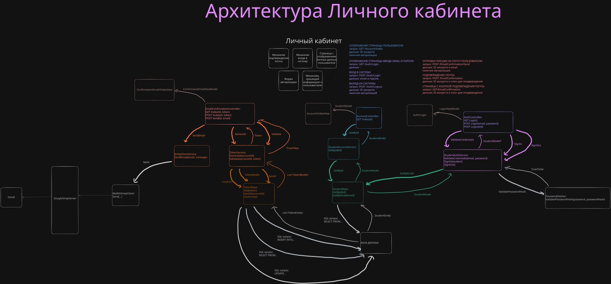

*Личный кабинет: `GET /Account/Index` открывает страницу пользователя, `POST /Auth/Login` проверяет email и пароль, выход — отдельный маршрут.*

### Как это работало у нас (на cookie)
При входе мы проверяем пароль, собираем про пользователя **claims** (это «утверждения» о нём:
Id, Email, роль) и просим ASP.NET выписать cookie:
```csharp
var claims = new List<Claim>
{
    new(ClaimTypes.NameIdentifier, account.Id.ToString()),
    new(ClaimTypes.Role, account.Role.ToString()),
    new(ClaimTypes.Email, account.Email),
};
var principal = new ClaimsPrincipal(new ClaimsIdentity(claims, CookieAuthenticationDefaults.AuthenticationScheme));
await ctx.SignInAsync(CookieAuthenticationDefaults.AuthenticationScheme, principal);
```
Дальше браузер шлёт эту cookie с каждым запросом, и приложение по ней понимает, кто перед ним,
— уже не спрашивая пароль заново.

### Роли
В ДЗ №5 мы клали роль в claim и потом ограничивали доступ:
```csharp
[Authorize(Roles = "Admin")]
public async Task<IActionResult> Admin() { ... }
// или прямо в коде:
if (User.IsInRole(AccountRole.Admin.ToString())) ...
```
Так кабинет администратора стал доступен только тем, у кого роль `Admin`.

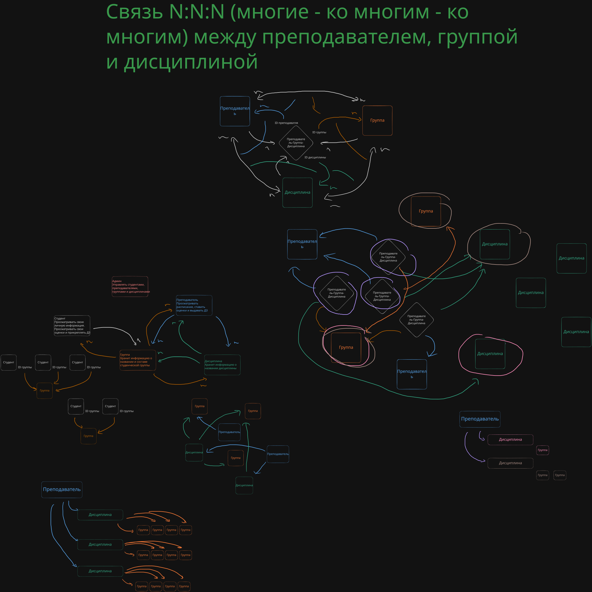

*Роли задают доступ: админ управляет всеми, преподаватель ставит оценки и выдаёт ДЗ, студент видит только свои данные.*

### Почему мы храним хэш, а не сам пароль
Очень важная тема. Мы **никогда** не храним пароль в открытом виде — храним его **хэш**:
```csharp
account.PasswordHash = hasher.HashPassword(account, password);                 // при регистрации
var result = hasher.VerifyHashedPassword(account, account.PasswordHash, input);// при входе
if (result == PasswordVerificationResult.Failed) return null;
```
Хэш — это **необратимое** преобразование. Из «example» можно посчитать хэш, но из хэша обратно
«example» не достать. При входе мы хэшируем введённый пароль и сравниваем два хэша.

Зачем так? Представьте, что базу украли. Если бы там лежали пароли в открытом виде — у
злоумышленника сразу все аккаунты, тем более что люди переиспользуют пароли. А с хэшами он
видит бесполезную кашу.

[ВАЖНО] Шифрование и хэширование — разные вещи. Шифрование обратимо (есть ключ — расшифровал),
хэш — нет. Хорошие хэшеры паролей вдобавок подмешивают **соль** (salt) — случайную добавку, —
поэтому одинаковые пароли двух людей дают **разные** хэши.

### Порядок в пайплайне
```csharp
app.UseAuthentication();  // сначала: разобрать cookie и понять, кто это
app.UseAuthorization();   // потом: проверить, можно ли ему сюда
```
Порядок логичный: нельзя проверить права, пока не знаешь, кто перед тобой.

### Где спотыкаются
- Путают аутентификацию и авторизацию — это разные шаги.
- Забыли `UseAuthentication` (или поставили после `UseAuthorization`) — и `User` всегда
  анонимный, `[Authorize]` всех заворачивает.
- В claim кладём `"Admin"`, а в `[Authorize(Roles = "Admin")]` опечатались — доступ не работает.
- 401 и 403 — это разное: 401 «не вошёл», 403 «вошёл, но прав нет».
- «Хэш можно расшифровать» — нет, нельзя. Сравнивают хэши, а не восстанавливают пароль.

### Вопросы для самопроверки
1. Чем аутентификация отличается от авторизации?
2. Почему мы храним хэш пароля, а не сам пароль?
3. Как мы сделали так, что админ-кабинет доступен только админам?

---

## 8. Конфигурация и секреты

Настройки приложения мы выносим из кода. Несекретные (строка подключения, параметры почты)
живут в `appsettings.json`, и читаем мы их через `IConfiguration` или через **Options**:
```csharp
builder.Services.Configure<SmtpSettings>(builder.Configuration.GetSection("Smtp"));
builder.Services.AddDbContext<AppDbContext>(o =>
    o.UseSqlite(builder.Configuration.GetConnectionString("SqliteDefaultConnection")));
```

А вот **секреты** — отдельная история. Пароль от Google-почты, через которую мы шлём письма, и
логин/пароль админа из `DbBootstrap` мы **не** клали в `appsettings.json` и **не** коммитили в
Git. Для них — **user-secrets** (ДЗ №5):
```bash
dotnet user-secrets set "Smtp:Password" "<App Password>"
dotnet user-secrets set "DbBootstrap:Password" "<пароль админа>"
```
В Marketplace ту же роль играли переменные окружения и `.env`.

### Почему секреты нельзя в репозиторий
Потому что репозиторий видят люди. В ДЗ №5 я прямо писал: если бы пароль попал в Git, то любой,
кто получит доступ к коду, получил бы доступ к моему Google-аккаунту — а это, мягко говоря,
некстати. Поэтому секрет лежит локально на машине разработчика, и каждый заполняет его у себя.

Отдельно показателен **App Password** у Google — это одноразовый токен, который не жалко
потерять. Сгенерировали, положили в секреты, забыли. Потеряли — выпустили новый, а основной
пароль аккаунта при этом нигде не светится.

### Где спотыкаются
- Под разные среды — разные конфиги: `appsettings.Development.json` против `appsettings.json`.
  Тот же `DbBootstrap` (засев тестового админа) у нас включается только в Development.
- Положили секрет в `appsettings.json` «на минуточку» — и он уже навсегда в истории Git.

### Вопросы для самопроверки
1. Где у нас лежат настройки и строка подключения?
2. Пароли в Git мы не кладём — куда тогда и почему?

---

## 9. Web API и REST

Web API, как мы уже говорили, отдаёт **данные (JSON)**, а не HTML. Контроллеры тут наследуют
`ControllerBase` и помечены `[ApiController]`. Наш `ProductsController` — это классический CRUD
(Create, Read, Update, Delete):
```csharp
[ApiController]
[Route("api/products")]
public sealed class ProductsController(ProductsService productsService) : ControllerBase
{
    [HttpGet("previews")]                 // получить список
    public async Task<ActionResult<...>> GetPreviewsAsync() => Ok(await productsService.GetPreviewsAsync());

    [HttpPost]                            // создать
    public async Task<ActionResult<CreateProductResponse>> CreateAsync([FromBody] CreateProductRequest request)
        => CreatedAtRoute(Routes.Product.Name.Get, new { id = response.Id }, response);

    [HttpGet("{id:guid}")]                // получить по id
    public async Task<ActionResult<...>> GetAsync([FromRoute] Guid id)
        => response is null ? NotFound() : Ok(response);

    [HttpPut("{id:guid}")]    // обновить
    [HttpDelete("{id:guid}")] // удалить → NoContent() / NotFound()
}
```

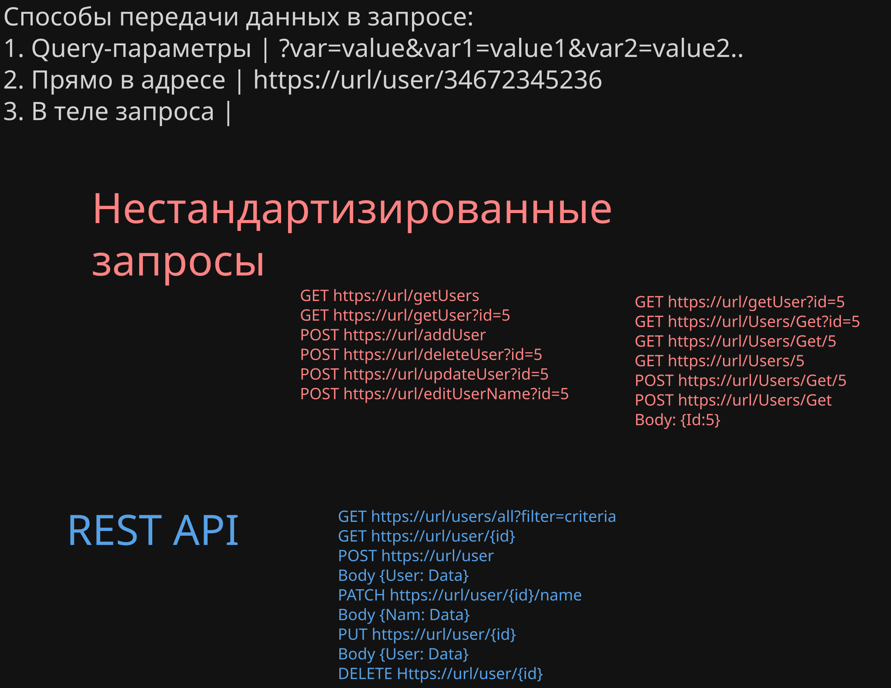

*REST задаёт стандартные методы (GET / POST / PUT / PATCH / DELETE) и три способа передать данные: query-параметры, путь или тело запроса.*

### Что тут от REST
REST — это набор договорённостей, чтобы API был предсказуемым:

- **Методы под операции:** GET — получить, POST — создать, PUT — обновить, DELETE — удалить.
  Глядя на метод, сразу понятно, что делает ручка.
- **Коды ответов вместо «просто объекта»:** `Ok` (200), `CreatedAtRoute` (201), `NoContent`
  (204), `NotFound` (404), `Forbid` (403). Клиент по коду понимает результат — это часть
  ответа. `CreatedAtRoute` к тому же кладёт в заголовок `Location` ссылку на созданный товар.
- **Откуда брать параметры:** `[FromBody]` — из тела (JSON), `[FromRoute]` — из адреса (`{id}`).
- **Swagger** — интерактивная документация: можно потыкать API руками, без фронтенда.

Передать данные в запросе, кстати, можно тремя способами (это видно на схеме выше):
query-параметрами (`?id=5`), прямо в адресе (`/user/5`) или в теле запроса.

### Где спотыкаются
- Вернуть 200 на «не найдено» — клиент не отличит успех от ошибки. Для этого и есть `NotFound()`.
- Путают `Controller` (умеет View) и `ControllerBase` (только данные) — для API нужен второй.

### Вопросы для самопроверки
1. Чем API отличается от MVC-сайта?
2. Какие HTTP-методы под какие операции CRUD?
3. Зачем возвращать `NotFound`/`NoContent`, а не просто данные?

---

## 10. Микросервисы и инфраструктура

В Marketplace мы не стали делать один большой бэкенд, а разбили его на несколько отдельных
сервисов: **ProductsApi**, **UsersApi**, **PurchaseApi**, плюс общая библиотека **Shared** и
контейнер **Migrations**. А перед ними поставили **API Gateway** на nginx.

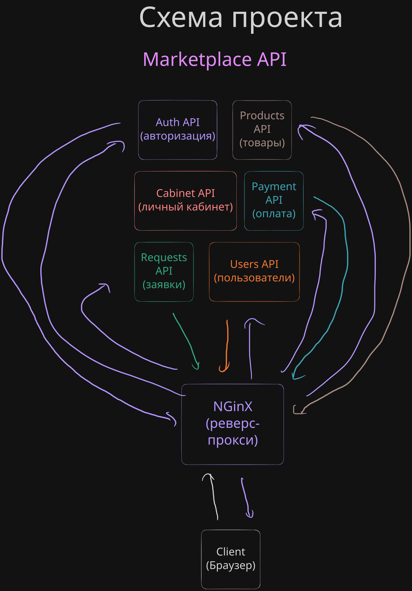

*Marketplace разбит на сервисы (Products, Users, Auth, Cabinet, Requests, Payment); перед ними NGinX как реверс-прокси — единая точка входа для клиента.*

### Зачем дробить
Каждый сервис отвечает за свою область: один — за товары, другой — за пользователей, третий —
за покупки. Их можно разрабатывать, разворачивать и масштабировать **по отдельности**, не
трогая остальные.

### Что делает gateway
Это единая точка входа. Клиент знает только один адрес, а nginx уже разбрасывает запросы по
сервисам в зависимости от пути:
```nginx
location /api/products  { proxy_pass http://products_api; }
location /api/users     { proxy_pass http://users_api; }
location /api/purchases { proxy_pass http://purchases_api; }
```
Снаружи виден только gateway, а сколько там сервисов за ним — клиент не знает и знать не должен.

### Docker и docker compose
Чтобы всё это поднималось одной командой, мы упаковали каждый сервис в Docker-образ, а
`compose.yaml` поднимает разом gateway, три API, базу Postgres и миграции:
```yaml
gateway-api: { image: nginx:alpine, ports: ["6139:80"], depends_on: [products-api, users-api, purchases-api] }
products-api:{ build: ..., expose: ["8080"], depends_on: [migrations] }
migrations:  { build: ..., depends_on: [database], restart: on-failure }
database:    { image: postgres:18-alpine, volumes: [database-data:/var/lib/postgresql] }
```

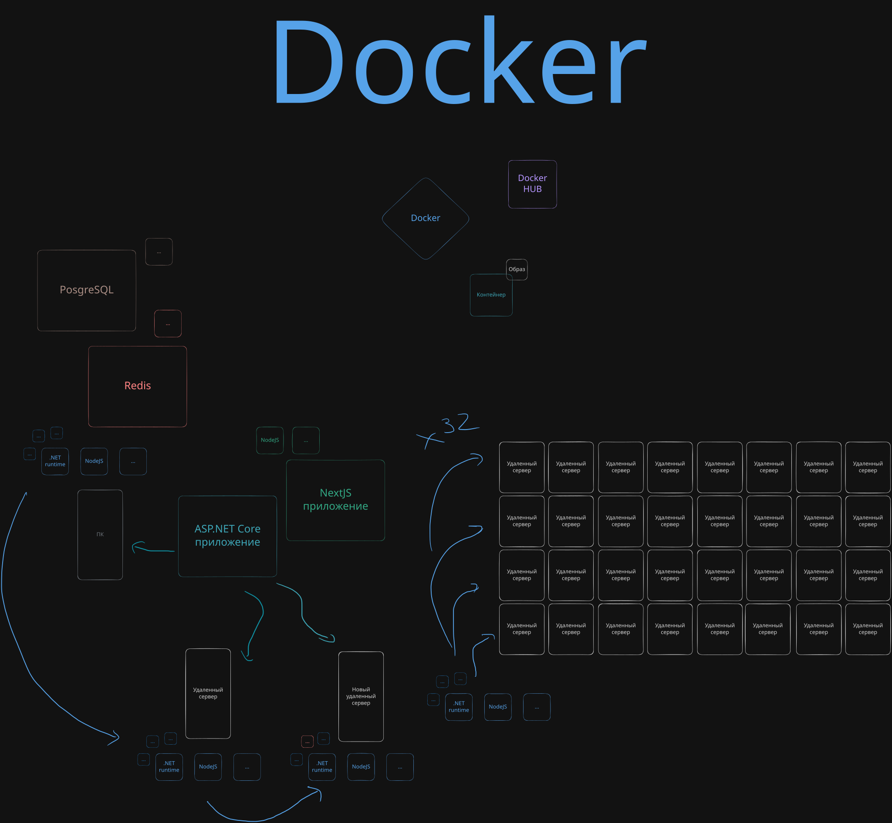

*Docker: из образа поднимается контейнер с рантаймом и приложением (.NET / NextJS / PostgreSQL / Redis); образы берутся из Hub, и тот же образ запускается и локально, и на сервере.*

[ВАЖНО] Не путайте **образ** и **контейнер**. Образ — это шаблон, рецепт (`products-api-318`).
Контейнер — это уже запущенный из него экземпляр. Из одного образа можно поднять сколько угодно
контейнеров. И ещё: `ports` (как у gateway, `6139:80`) открывает порт наружу, а `expose` (как у
сервисов, `8080`) — только внутри сети compose. Поэтому снаружи достучаться можно только до
gateway.

И самодостаточность: внутри образа лежит и приложение, и нужный рантайм (.NET), поэтому на
сервере не надо вручную ставить ни .NET, ни саму базу. Образ запускается одинаково и на вашем
ПК, и на удалённом сервере — в этом вся идея Docker, «работает у меня» превращается в «работает
везде одинаково».

### Общая авторизация между сервисами (для любознательных)
Тут есть тонкость. Cookie, которую выписал UsersApi, должна приниматься в ProductsApi. А cookie
шифруется ключом. Если у каждого сервиса ключ свой — чужую cookie он не поймёт. Поэтому все
сервисы делят **общий ключ DataProtection** (один том на всех):
```csharp
services.AddDataProtection()
    .PersistKeysToFileSystem(new DirectoryInfo("/home/app/.aspnet/keys"))
    .SetApplicationName("MarketplaceApi");
```

### Вопросы для самопроверки
1. Зачем дробить приложение на несколько сервисов, а не делать один большой?
2. Что делает gateway?
3. Чем образ отличается от контейнера?

---

## 11. Транзакции и конкурентный доступ

Вот ситуация: пользователь покупает товар. Что при этом должно произойти? Списать деньги у
покупателя, начислить продавцу, уменьшить остаток товара и создать запись о покупке. Это
**четыре** изменения, и они должны примениться **все вместе или никак**.

Почему «или никак»? Представьте, что на середине что-то сломалось: деньги у покупателя списали,
а товар уменьшить не успели. Получите неконсистентные данные — человек заплатил, а товара нет.

Чтобы такого не было, мы оборачиваем всё в **транзакцию**. В `PurchaseService`:
```csharp
await using var transaction = await transactionManager.BeginTransactionAsync();
try
{
    var product = await productsRepo.FindByIdWithLockAsync(request.ProductId);
    if (product.Amount == 0) throw new InvalidOperationException("sold out");
    var buyer  = await usersRepo.FindByIdWithLockAsync(buyerId);
    if (buyer.Balance < product.Price) throw new InvalidOperationException("not enough money");
    var seller = await usersRepo.FindByIdWithLockAsync(product.SellerId);

    buyer  = buyer.WithDecBalance(product.Price);   // списать у покупателя
    seller = seller.WithIncBalance(product.Price);  // начислить продавцу
    product = product.WithDecAmount();              // уменьшить остаток
    // + создать запись о покупке

    await transaction.CommitAsync();                // всё прошло — фиксируем
}
catch { await transaction.RollbackAsync(); throw; } // что-то упало — откатываем всё
```
Это и называется **атомарность**: либо все четыре изменения применились (`Commit`), либо ни
одного (`Rollback`).

### Конкурентный доступ — гонка за последним товаром
А теперь представьте, что товар остался **один**, и два покупателя жмут «купить»
одновременно. Без защиты оба прочитают `Amount = 1`, оба пройдут проверку «товар есть» и оба
купят. Товар продан дважды — а он один.

Это называется **race condition** (состояние гонки). Лечим блокировкой строки. Обратите
внимание на `FindByIdWithLockAsync` — внутри он делает:
```sql
SELECT * FROM users WHERE id = @p0 FOR UPDATE
```
`FOR UPDATE` блокирует строку до конца транзакции. Второй запрос **ждёт**, пока первый
закончит. А когда дождётся — увидит уже `Amount = 0` и честно получит «sold out».

### Где спотыкаются
- Транзакция без `try/catch` и `Rollback` — при ошибке изменения зависнут незакоммиченными.
- Проверили и записали порознь, без блокировки — это и есть источник гонки: между «прочитал»
  и «записал» кто-то успел вклиниться.

### Вопросы для самопроверки
1. Почему покупку мы оборачиваем в транзакцию?
2. Что будет без транзакции, если на середине операции случится ошибка?
3. (посложнее) От чего спасает `FOR UPDATE`, когда двое покупают последний товар одновременно?

---

## 12. Основы HTTP

HTTP — это протокол «запрос–ответ» между клиентом и сервером. Он лежит в основе всего, что мы
делали: и авторизации, и API, и форм. Поэтому полезно держать в голове его азбуку.

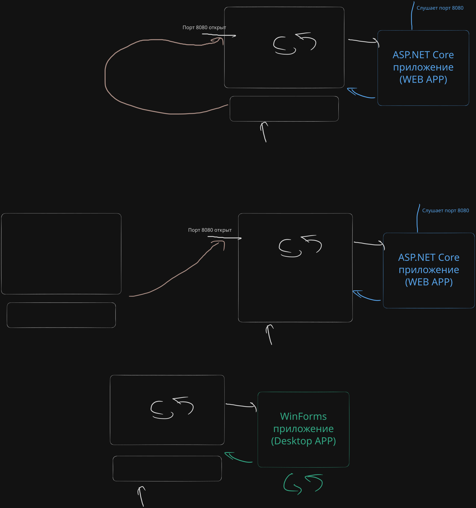

*Веб-приложение, в отличие от десктопного, слушает порт и общается с клиентом по сети — поверх HTTP.*

Кстати, вот хорошее наблюдение: десктопное приложение (WinForms) работает само на вашем
компьютере, а веб-приложение **слушает порт** (например, 8080) и ждёт запросов по сети. В этом
их принципиальная разница.

### Что точно нужно знать
- **Методы:** GET (получить), POST (создать/изменить), PUT (обновить), DELETE (удалить).
- **Статус-коды:** 200 OK, 201 Created, 204 No Content, 401 Unauthorized (не вошёл), 403
  Forbidden (вошёл, но прав нет), 404 Not Found, 500 — ошибка сервера.
- **Cookie** — данные, которые хранятся у клиента и шлются с каждым запросом. Именно так у нас
  держится состояние входа.
- **JSON** — формат, в котором API обменивается данными с фронтендом.

### Вопросы для самопроверки
1. В чём разница между 401 и 403?
2. Что такое cookie и зачем она нужна в авторизации?
3. В каком формате API общается с фронтендом?

---

## 13. Фронтенд и связь с API

Фронтенд Marketplace написан на Next.js / React / TypeScript. Принцип простой: интерфейс
собирается из **компонентов** (переиспользуемых кирпичиков), а данные он берёт из нашего API.

Вот страница со списком товаров — она запрашивает товары и рисует список:
```tsx
export default async function ProductsPage() {
    const products = await ProductsApi.getAll();
    return <ProductCardsList cards={products} />;
}
```
Сам поход в API (через axios):
```ts
const response = await axios.get<ProductPreview[]>(routes.productsApi.products.get.all, { baseURL });
return response.data;
```
А карточка товара принимает данные через **props** (это её входные параметры) и имеет **тип**:
```tsx
export type ProductCardProps = Omit<ProductPreview, 'id'>;
export default function ProductCard({ name, previewUrl, createdAt, updatedAt }: ProductCardProps) { ... }
```
```ts
export default interface ProductPreview {
    id: UUID; name: string; previewUrl: string | null; createdAt: Date; updatedAt: Date;
}
```

Тип `ProductPreview` описывает форму данных, которые приходят от API. Это даёт автодополнение в
редакторе и ловит ошибки ещё на этапе написания кода, а не в рантайме. Так и замыкается вся
картина: **Web API отдаёт JSON → фронтенд его типизирует и рисует**.

Тема мягкая, глубоко копать не нужно — достаточно понимать связку «компонент + props + поход в
API за данными».

### Вопросы для самопроверки
1. Что такое компонент и props на примере карточки товара?
2. Как фронтенд получает список товаров?
3. Зачем нужны типы в TypeScript?

---

## 14. Git и рабочий процесс

Это то, как мы вели разработку и сдавали домашки. Тут важно понимать не команды наизусть, а
саму логику.

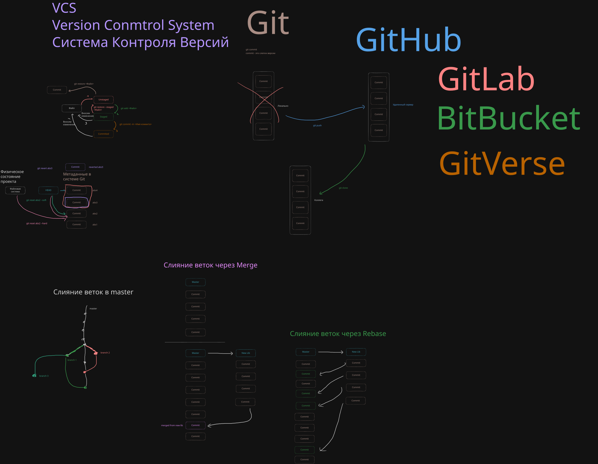

*Файл проходит стадии: рабочий каталог (unstaged) → `git add` → staged → `git commit` → локальный репозиторий → `git push` → GitHub; коллега берёт проект через `git clone`.*

- **Fork** — это ваша личная копия учебного репозитория, в которую у вас есть права писать (в
  мой репозиторий вы писать не можете).
- **origin и upstream** — это просто две «переменные» с адресами репозиториев. `origin` —
  ваш форк (туда вы пушите домашку), `upstream` — учебный репозиторий (оттуда вы тянете свежие
  изменения с занятий):
  ```bash
  git fetch upstream
  git checkout -b lessonX-XX upstream/lessonX-XX
  ```
- **Цикл изменений:** `git add .` → `git commit -m "..."` → `git push`. Сначала набрали
  изменения в staging, потом зафиксировали коммитом, потом отправили на GitHub.
- **Pull Request** — это предложение влить вашу ветку. В нём виден diff, изменения можно
  обсудить. Домашки вы сдавали именно ссылкой на открытый PR.

### Зачем так, а не пушить всё в master
- **Ветки** изолируют работу: эксперименты и домашка не ломают основную ветку.
- **Коммиты — это история и точки возврата.** Каждый коммит — снимок проекта, к которому можно
  откатиться. Поэтому коммитим осмысленными порциями («создал сервис — коммит», «добавил
  миграцию — коммит»), а не всё одной кучей в конце.
- **Pull Request** — ровно так работают в реальных командах: не пушат напрямую в общую ветку,
  а предлагают изменения через PR, чтобы их посмотрели.

### Где спотыкаются
- Делают домашку от master, а не от ветки занятия — задание может быть для master уже неактуально.
- Закоммитили лишнее (`bin/`, `obj/`, `.idea/`, секреты) — для этого есть `.gitignore`.

### Вопросы для самопроверки
1. В чём разница между origin и upstream в нашем процессе?
2. Зачем сдавать домашку через Pull Request, а не пушить в master?
3. Какие команды нужны, чтобы изменения попали на GitHub?

---

## Частые ошибки — чего избегать

Короткий список самых частых граблей по всем темам. Пробегитесь перед экзаменом и проверьте,
не наступаете ли вы на них в своём коде.

| Тема | Типичная ошибка | Чем грозит / что помнить |
|------|------------------|----------------------------|
| EF Core | Забыли `SaveChanges` | «Удалил/добавил, а в базе пусто» — операции копятся в контексте |
| EF Core | Фильтр через `ToList().Where()` | Тащим всю таблицу в память; `Where` должен уезжать в SQL |
| EF Core | Поменяли модель без миграции | Код ждёт колонку, которой нет в базе |
| DI | Не зарегистрировали сервис | `Unable to resolve service for type ...` на запросе |
| DI | Перепутали Singleton/Scoped | In-memory теряет данные / sqlite не собирается |
| Формы | Изменение данных через GET | Срабатывает от обновления/предзагрузки/роботов — нужен POST |
| Формы | `name` ≠ имя параметра | Model binding не сработал, пришёл `0`/`null` |
| PRG | Вернули HTML вместо Redirect | F5 повторяет POST (двойное удаление/создание) |
| Валидация | Только клиентская проверка | Клиент обходится запросом мимо формы |
| Валидация | На ошибку `RedirectToAction` | Теряются ошибки и введённые данные; нужно `return View(model)` |
| Auth | Нет/не там `UseAuthentication` | `User` анонимный, `[Authorize]` всех заворачивает |
| Auth | Несовпадение строки роли | `[Authorize(Roles="Admin")]` не пускает из-за опечатки |
| Auth | «Хэш можно расшифровать» | Хэш необратим; сравнивают хэши, не восстанавливают пароль |
| Секреты | Пароль в `appsettings.json` | Утечка через Git; секреты — в user-secrets/env |
| API | Вернули 200 на «не найдено» | Клиент не отличит успех от ошибки; нужен `NotFound()` |
| Транзакции | Проверка и запись без блокировки | Гонка: последний товар продаётся дважды |
| HTTP | Путают 401 и 403 | 401 — не вошёл; 403 — вошёл, но прав нет |

---

## Как проходит экзамен

- Это **разговор**, а не зубрёжка. Если что-то подзабыли — подскажу наводящим вопросом.
- Достаточно объяснить **идею своими словами** и понимать, **зачем** оно нужно; дословные
  формулировки учить не надо.
- На каждого — **5–10 минут**: одна основная тема и пара уточняющих вопросов. Отвечаете сразу,
  без подготовки.
- Ориентир по темам: 1–5 — база, их стоит знать всем; 7 и 9 — следующий уровень; 10–11 — для
  тех, кто уверен в основе.
- Тему сложности алгоритмов (ДЗ №3) глубоко спрашивать не буду.
